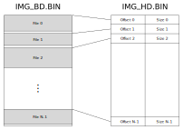

# Language File Binary Format

This document describes the binary format of the archive files containing all assets of the game (except the main cinematics which are stored externally as files on the disk).

## Table of Contents

[Introduction](#introduction)  
[Archive Files](#archive-files)  
[Data File Structure](#data-file-structure)

## Introduction

In the PS1 and PS2 era, it was not so uncommon for game producers to conceal game assets. Be it for this reason or for DVD read speed optimization, all game assets except for cinematics are packed together in as single file. To access each file, both offset and size for each file are stored in another file, which serves as index. This is pretty much how a simple filesystem works, except that here either the filename and timestamp information is not present. However, filenames are stored into the main executable and are used to access each file during gameplay. The idea is that when the game runs, the executable containing the list of files is loaded into memory. When the game wants to access a file by its name it goes through the list of files and calculate the index of that specific file in the list. Once it knows the index it can access the index file to recover both offset and size of the file. Finally, it can access the asset file at the previously obtained offset and read up to the maximum size.

## Archive Files

In the introduction we gave a high-level idea of how the game stores and read files. Here we give an in-depth analysis of how each file works and propose a way to unpack and repack each file for modifications.

The game spreads the various information about its assets in three files:

- the main executable (e.g. SLES_508.21 for the european version, SLPS_250.74 for the japanese version and SLUS_203.88 for the US one) contains a list of filenames at a specific offset, which is different for each file but always starts with the following string: `CD_FILE_DAT`
- both offset and position of each file are stored in an "index" file called `IMG_HD.BIN`. Here all information is stored sequentially as little endian unsigned 32-bit integers (or 4 bytes). Meaning that, if `x` files are stored, there will be `2*x` unsigned integers in the file, which will have a size of `8*x` bytes.
- the actual files are stored sequentially in a "data" file called `IMG_BD.BIN` which contains the files pointed by the index file `IMG_HD.BIN`. Differently from the index files, when a file ends, the data of the following file is not stored right after, but instead each file is aligned to an offset multiple of `2048`. This number corresponds to the ISO 9660 filesystem block size and was probably chosen to align each file at the beginning of a block in the disk. Files are not aligned to the next multiple of 2048 but to a bigger multiple of 2048. This will be analyzed in details in the following sections.

The next figure shows the structure of the index file and the data file, highlighting how one is connected to the other.

## Data File Structure

TODO
