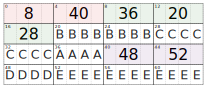
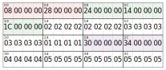

# Language File Binary Format

This document describes the binary format of the language files the game uses to render
text. First there is a brief introduction on the format with a simple example, then
it describes how these files are used in the three localizations of the game (Japanese,
American and European).

## Table of Contents

[Introduction](#introduction)  
[Encoding Example](#encoding-example)  
[Language Game Files](#language-game-files)

<a name="introduction"></a>

## Introduction

In-game text is stored in binary files where strings are encoded using
localization-specific text tables. Each encoded string is saved in the file at a
specific offset which is stored in a table usually placed right before the strings
it contains. These files always start with an offset table that serves as root table
for other tables. Likewise, a sub-table can contain either a list of offsets pointing
to other tables or a list of encoded strings of text. There are no instances in the
game files where an offset table contains both tables and strings. Moreover, since
only the starting offset is saved and the relative length is not, there is no
explicit way to understand where a string ends, so it implicitly continues until
another string starts. The game expects to find a special character representing the
end of the string in specific instances, but it is not a general rule. The following
section shows a simple yet complete example of how strings are encoded and how their
offsets are stored in tables to understand better how strings are laid out into
the files.

<a name="encoding-example"></a>

## Encoding Example

Suppose we want to encode, for the sake of simplicity, 5 strings: 'AAAA', 'BBBBBBBB',
'CCCCCCCC', 'DDDD', and 'EEEEEEEE'. We also want to organize them into two groups:
GROUP-01 and GROUP-02. If, for example, we were to think of them as files and directories,
we would end up with something like:

```
ROOT
  ├─ GROUP-01:
  │    ├─ 'AAAA'
  │    ├─ 'BBBBBBBB'
  │    └─ 'CCCCCCCC'
  └─ GROUP-02:
       ├─ 'DDDD'
       └─ 'EEEEEEEE'
```

The previous graph more or less represents the internal structure of a language file,
where group of strings (in-game messages or text) are sequentially encoded. First the
"root" groups are encoded as an offset table where each 32-bit value points to either
another table or to a group of strings. Each string is then encoded using a look-up
table that is unique for each language of the game (Japanese, American and the 5
European languages, although all tables for the european languages are identical).

The following figure shows how our toy example would be encoded as binary file. Here
offsets are shown using decimal values and strings are left as sequence of characters
instead of being encoded into their respective byte representation. Moreover, to better
highlight the internal structure, table offsets have been colored with a different
color for each table.



We can see that the beginning of the file contains the two root table entries. The first
one points to the first group of strings, which is itself an offset table of three
elements each one pointing to the beginning of each string. The second one points to the
second group of strings, which is stored right after the first group. It is worth
noting, as shown in the previous figure, that neither the number of root groups,
the number of strings in each group or the length of each string is explicitly stored.
Each of them can be understood by considering the boundaries of the others tables and
strings. For examples, we can understand that the root table consists of two elements
because the (in this specific example) fist group offsets is at address 8. Since all
offsets are stored continuously, the root table cannot extend after this offset, and thus
consists of two elements (since each of them is stored as an unsigned 32-bit integer
with little endian encoding). Mind that even if all elements in a table are stored
continuously, this does not mean that they are stored in order. The table of the first
group of strings shows exactly this. The first string starts at offsets 36, the second
at offset 20, and the last one at offset 28. This also means that it is not sufficient
to look at the first element in a table to understand how many elements are presents,
but it is necessary to look at each one of them and consider the smallest one, until
we reach one of the previously encountered offsets.
Looking again at the table for the first group starting at offset 8, by reading the
first element we can deduct that the table cannot extend over offset 36, and so it
must contain no more than 7 entries. This means that we can continue reading another
offset, here 20, which tells us that instead of the maximum 7 entries, we are not
limited to at most 3. The third offset (28) does not tell us anything new since it is
bigger than the previous ones.



<a name="language-game-files"></a>

## Language Game Files

All localizations share the same file pattern:

| Filename     | Usage                                                                                          |
| :----------- | :--------------------------------------------------------------------------------------------- |
| IG_MSG.OBJ   | Contains almost every text rendered in the game,<br/>except some night-specific event strings |
| M0_EVENT.OBJ | Contains few strings of specific events for the intro                                          |
| M1_EVENT.OBJ | Contains few strings of specific events for the first night                                    |
| M2_EVENT.OBJ | Contains few strings of specific events for the second night                                   |
| M3_EVENT.OBJ | Contains few strings of specific events for the third night                                    |
| M4_EVENT.OBJ | Contains few strings of specific events for the fourth night                                   |

For the european localization, each language has its own set of files, each of them
suffixed with a letter that indicates the corresponding language. For example, in the
case of IG_MSG.OBJ:

| Filename     | Usage                |
| :----------- | :------------------- |
| IG_MSG_E.OBJ | English localization |
| IG_MSG_F.OBJ | French localization  |
| IG_MSG_G.OBJ | German localization  |
| IG_MSG_S.OBJ | Spanish localization |
| IG_MSG_I.OBJ | Italian localization |
